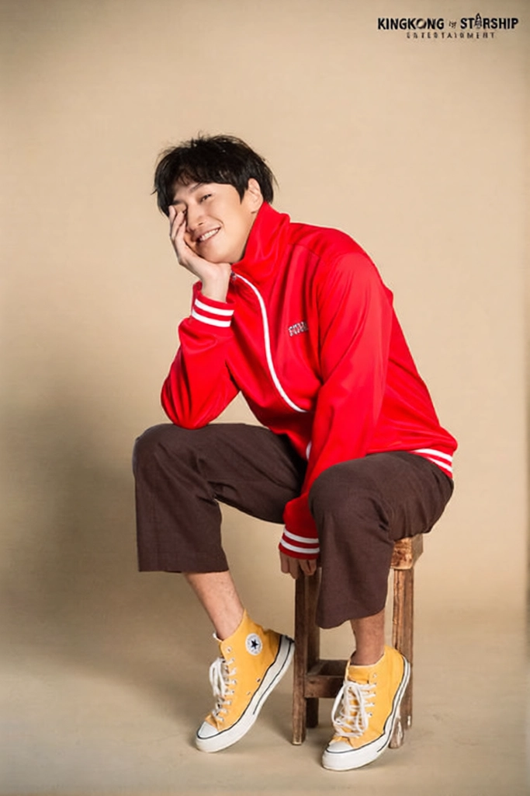
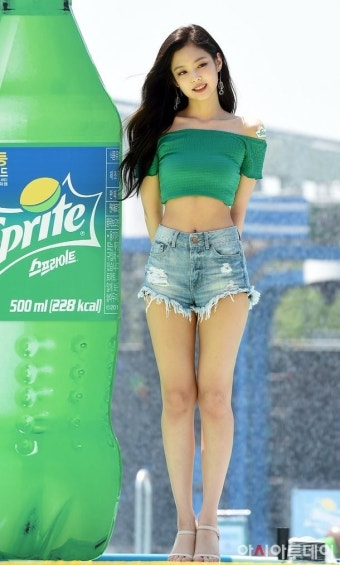
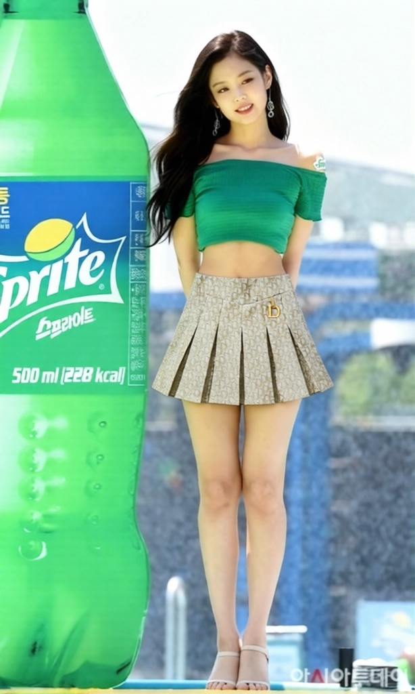
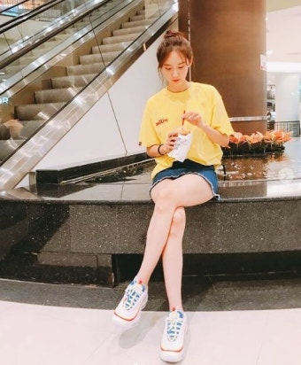
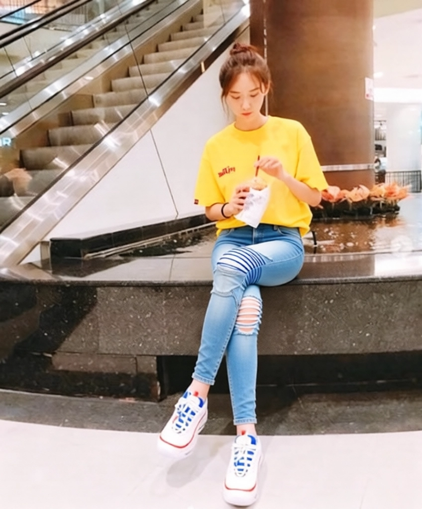

# 가상 피팅 SAMPLE - 202101951 김승연
## 기본 설명
> 2025.12.5일에 API키 소멸 예정!
* Gemini-nanobanana의 평균 출력속도 40s에 비해 월등히 상회. (첫 번째 cold start 이후 평균 10초)
* 상/하의 전부 가상 피팅 지원.
* 복잡한 배경에서도 무리 없이 가상 피팅 가능.
* AES 암호화를 통한 보호.
* API 지원

## Sample_output
* 남자 앉아있는 사진 의류 변경
<p align="center">



</p>

* 여성 의류 변경
<p align="center">




</p>

## Usage
1. requirements.txt 설치  
    ```python
    pip install -r requirements.txt

2. sample_vto.py 설정 변경
    ```python
    class SampleVto:
    def __init__(self):
        self.api_key = "rpa_AB~~~"

        self.person_image_path = r"사람 사진의 경로를 입력해주세요 !!"
        self.clothes_image_path = r"옷 사진의 경로를 입력해주세요!"
        ...

3. 실행
    * 최상위 패키지에 "result.webp"로 저장됩니다.